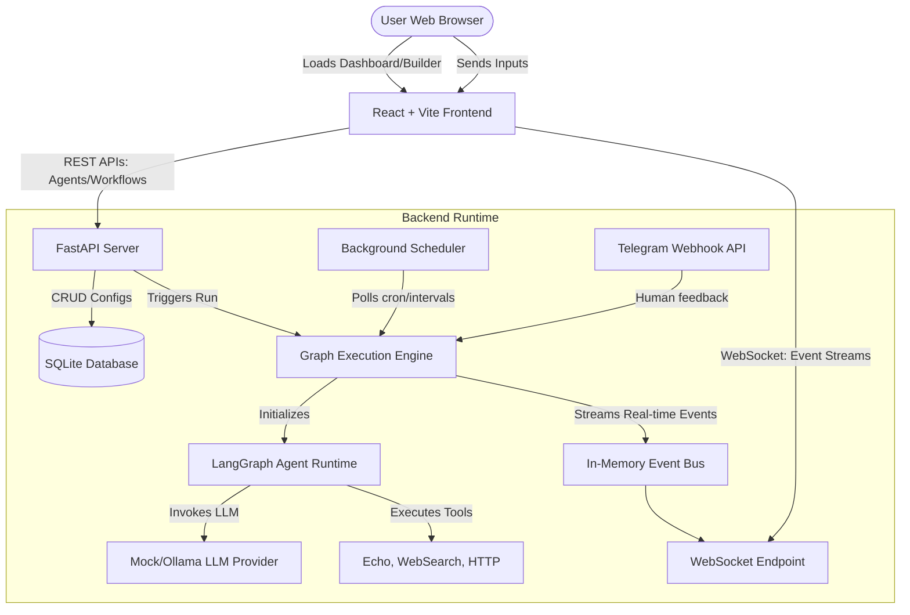

# AI Agent Orchestration Platform

This repository contains a visual, local-first platform designed to configure autonomous AI agents, visually map them into complex, cyclic collaborative workflows, and monitor execution in real time.

---

## Architecture Decisions & Tech Stack Justifications

### 1. Python, FastAPI & LangGraph (Backend)
- **FastAPI**: Selected for its asynchronous capabilities, fast execution, self-documenting Swagger OpenAPI endpoints, and native WebSocket support, which enables real-time logging and execution stream delivery.
- **LangGraph**: Leveraged as the core agent runtime. Unlike linear chain orchestration models, LangGraph allows modeling agent interactions as stateful cyclic graphs. This enables feedback loops, autonomous tool-calls, and structured agent-to-agent dialog routing.
- **SQLite & Repositories**: A lightweight, file-based SQLite database is utilized to ensure the platform requires no heavy external dependencies (such as PostgreSQL or MySQL) to run locally, fitting the local setup requirement perfectly.

### 2. React, TypeScript & Tailwind CSS (Frontend)
- **ReactFlow**: Used to build the visual canvas builder. ReactFlow provides a robust grid API to draw nodes, link directional edges, track layouts, and fire callbacks on selection or connection.
- **Tailwind CSS**: Chosen for styling the premium dashboard, agent configurations, and dark-themed run timelines with seamless CSS animations and glassmorphic panels.

---

## System Architecture Diagram



---

## Quick Start Setup Instructions

You can boot the entire system (both backend FastAPI and frontend React Vite) with a single setup command:

```bash
make dev
```

This will:
1. Auto-detect and install frontend node dependencies if `node_modules` is missing.
2. Initialize and boot the Python FastAPI server on [http://localhost:8080](http://localhost:8080).
3. Initialize and boot the Vite server on [http://localhost:5173](http://localhost:5173).

Press `Ctrl+C` in the terminal to stop both servers gracefully.

---

## How to Add New Components

### 1. Adding a New Workflow Template
To pre-seed a new workflow template, edit `backend/api/main.py` inside the `seed_database()` function:
1. You can also add new template using UI

### 2. Adding a New Messaging Channel
To integrate a new channel (e.g. Slack or Discord):
1. Create a base class inheriting from `Channel` in `backend/core/channels/base.py`.
2. Define the webhook endpoint in `backend/api/webhooks/` to receive incoming messages.

##  To Setup LLM Ollama for testing 
1. Install and Start Ollama
brew install ollama
2. Start Ollama as a background service:
brew services start ollama
3. Pull the Llama 3.1 model:
ollama pull llama3.1

##  To Setup ngrok for telegram webhook for local testing
1. Install ngrok:
brew install ngrok
2. Add your ngrok authentication token:
ngrok config add-authtoken <NGROK_AUTH_TOKEN>
3. Start an ngrok tunnel (replace 8080 with your application's port):
ngrok http 8080
Copy the generated HTTPS URL (for example, https://...ngrok-free.dev).
4. Below config in backend/.env
TELEGRAM_BOT_TOKEN=
TELEGRAM_BOT_CHAT_ID=
PUBLIC_WEBHOOK_URL=